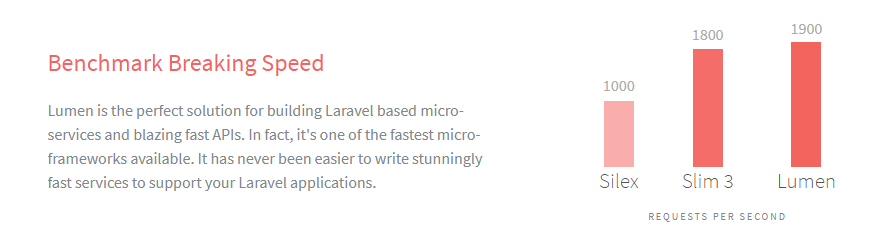

### 개요

백엔드를 다루기에는 정말 많은 방법들이 있습니다.

예를 들어 현재 3학년이 배우는 Spring Boot, 2학년들이 배우게 될 php, 가장 많이 접할 기회가 있는 Node.js 등이 있습니다.

앞으로 잠재력이 넘쳐나는 여러분들의 역량으로는 여기 외에도 더 많은 언어와 프레임워크를 사용하실 수 있으리라 믿고요.

이 강좌에서는 php 마이크로 프레임워크 **Lumen**을 사용하여 REST API를 만들어보려고 합니다.

### REST, REST API

REST는 *Representational State Transfer*의 약자입니다. 이는 **자원을 식별자로 구분하여 정보를 주고받는 일련의 모든 것**을 의미합니다.

`HTTP` 프로토콜을 사용하므로, **웹 개발의 장점을 최대한으로 살려낼 수 있습니다**.

간단히 설명하면, 서버와 클라이언트가 정보를 주고받는 하나의 방법이라고 알고 있으시면 됩니다.

REST API는 이 REST 기반으로 만들어진 서비스 API입니다. REST API는 `HTTP`**를 지원하는 모든 언어**로 클라이언트를 만들어낼 수 있습니다.

> 참고한 글: [링크](https://gmlwjd9405.github.io/2018/09/21/rest-and-restful.html)

### Lumen

> The stunningly fast micro-framework by Laravel.

Lumen은 php 프레임워크 Laravel에서 백엔드에 더 충실하도록 나오게 된 `Micro-framework`입니다. 그래서 Laravel에서 `View` 관련 기능을 제외하고는 대부분의 기능을 사용할 수 있습니다.

Lumen은 이 강좌의 제목대로 **눈부시도록 빠르게** API를 만드는 데 되게 유용하며, 또 **눈부시도록 빠른** 속도도 자랑하고 있습니다.

> Lumen 공식 사이트. 엄청난 속도를 자랑한다고 합니다.
