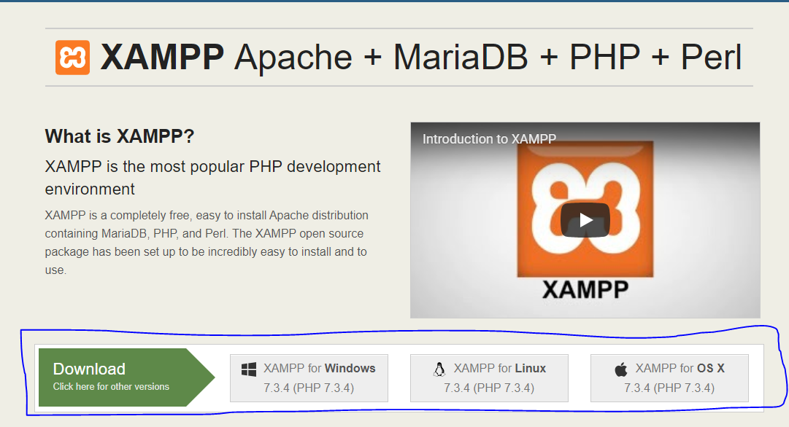
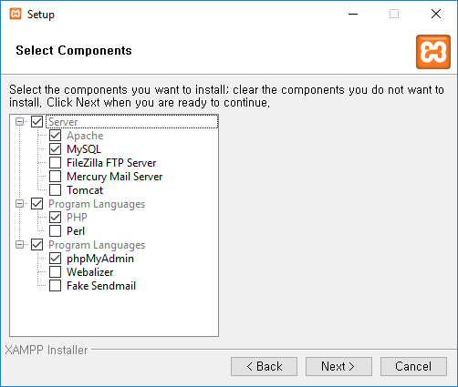
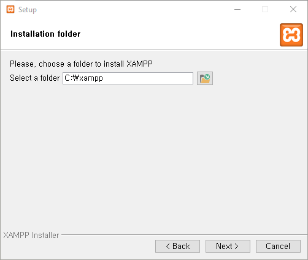
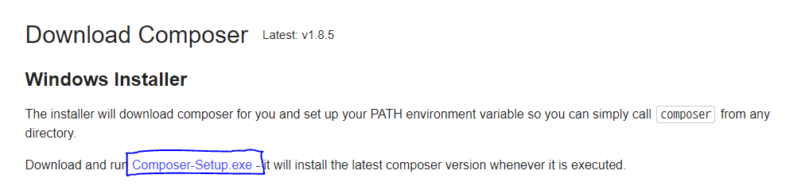

### XAMPP

XAMPP는 `Apache` + `MariaDB(MySQL)` + `PHP` + `Perl` 의 개발환경 묶음입니다. 저희는 이 중에서 `MariaDB`와 `PHP`를 사용할 것이기 때문에, XAMPP를 설치해보도록 합시다.

> 만약 패키지 매니저(`Chocolatey`, `Homebrew`, etc..) 등을 사용하신다면 개별적으로 `MariaDB`와 `PHP`를 설치하셔도 무방합니다.

1. XAMPP 사이트로 접속하고, 설치 파일을 내려받습니다.

[XAMPP 공식 사이트](https://www.apachefriends.org/index.html)




2. 설치를 진행합니다.



> 만약 `MySQL`이 이미 설치되어 있다면 체크박스를 해제해주세요.



> 큰 문제는 없으나, 경로를 건드리지 않는 것을 권장합니다.


### Composer

`Node.js (JavaScript)`에는 `npm`이라는 패키지 매니저가 존재합니다. `php`에도 당연히 패키지 매니저가 있는데, 이를 `Composer`라고 합니다.

`Lumen`은 `Composer`를 이용하여 설치하기 때문에, 반드시 설치해야 합니다.

1. Composer 다운로드 사이트에서 설치 파일을 내려받습니다.

[Composer 다운로드 사이트](https://getcomposer.org/download)



2. 설치를 진행합니다.

> 별다른 작업 없이 Next 누르시기만 하면 됩니다.


### Lumen 설치 절차

1. 다음 명령어를 입력합니다. (다음부터 Lumen 프로젝트를 만들게 될 때 이 작업은 생략해도 됩니다!)

```sh
$ composer global require "laravel/lumen-installer"
```

2. 프로젝트를 담을 폴더 내에서 다음 명령어를 입력합니다.

```sh
$ lumen new <프로젝트-이름>
```

3. Lumen 프로젝트가 있는 폴더에서 `.env.example` 파일을 `.env`로 이름을 변경합니다.

4. `app\bootstrap.php` 파일을 열어 다음 코드의 주석을 해제합니다.

```php
$app->withFacades();
$app->withEloquent();
```

5. 끝났습니다! 테스트로 서버를 실행시킵니다.

```sh
$ php -S localhost:8000 -t public
```